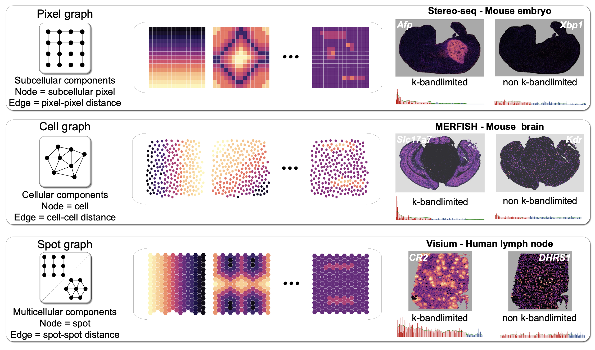

## About
```SpaGFT``` is a python package to analyze tissue functions empowered using spatial omcis data. 

Given the raw count matrix of spatial transcriptomics data and corresponding spatial coordinate information, _SpaGFT_ transforms grapg gene expression
to frequency domain (also called spectral domain), i.e., finding a new topological feature representation
method of genes which combined gene expression and spatial information of spots
simultaneously. _SpaGFT_ can transform complex spatial patterns into one-dimensional, simple but informative Fourier Coefficients (FCs). In this way, several tasks can be achieved by analyzing FCs, include identifying spatially variable genes (SVG), and enhancing gene expression.




### SpaGFT's functions
- Transform gene expression to FCs.

- Identify spatially variable features, including but not limited to genes and proteins.

- Enhance spatial signals (e.g., gene expression).

### SpaGFT's advantages
- Hypothesis-free. _SpaGFT_ is a hypothesis-free graph Fourier transform framework (GFT) from spatial transcriptomics data without assuming any spatial distribution patterns. 

- Computational effectiveness and efficiency. _SpaGFT_ can run on PC directly and still keep high accuracy and efficiency (time complexity is O(n^2)). 

- SpaGFT can be also used for sequencing-based and imaging-based spatial transcriptomics, spatial-CITE-seq, and spatial proteomics.
